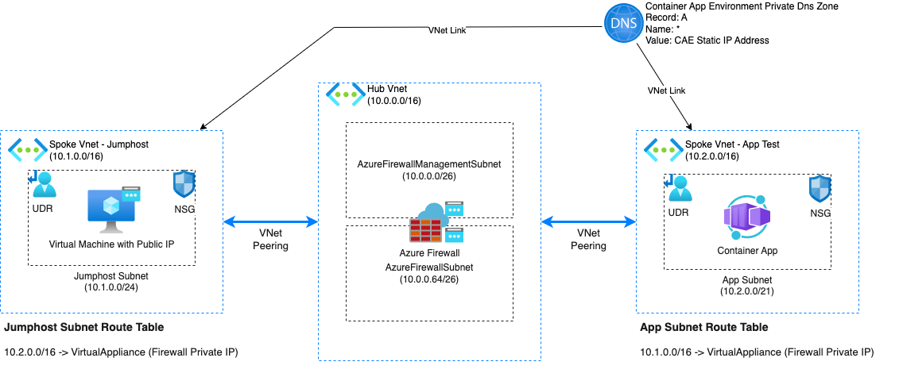
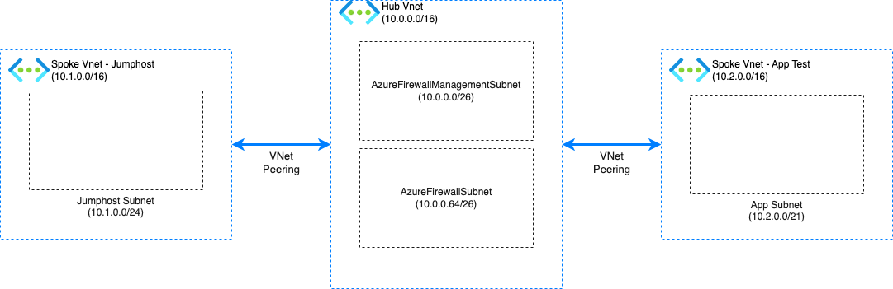
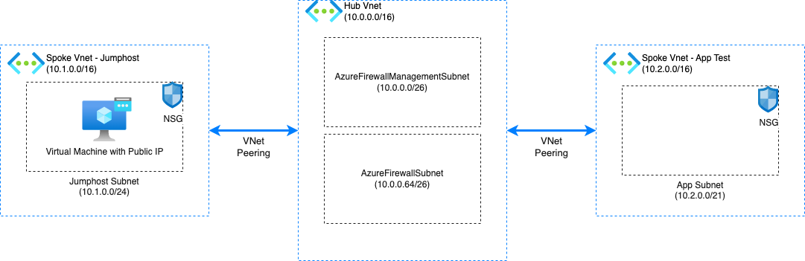
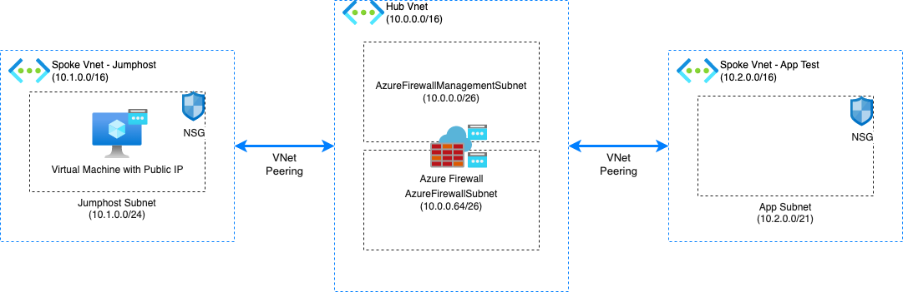
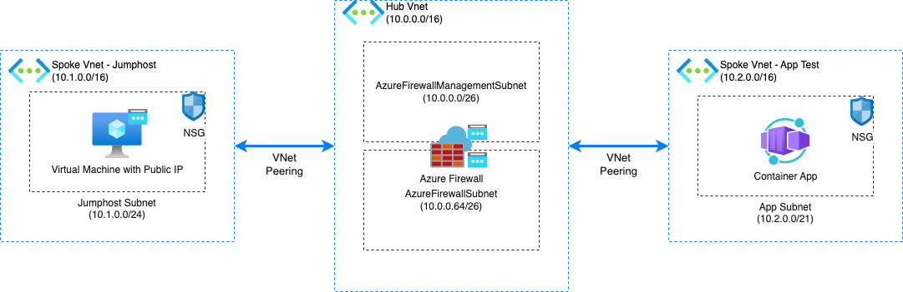
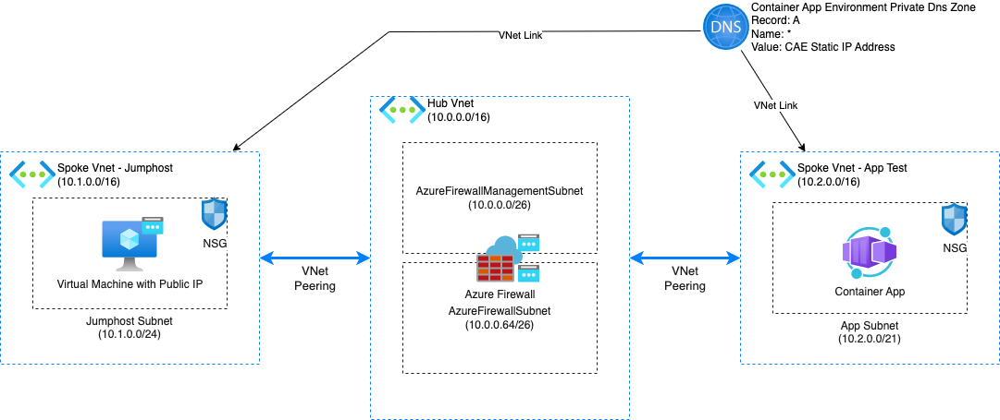

# Zadania Domowe Szkolenie Terraform: Zjazd 4

W ramach tego zadania domowego utworzysz zasoby pod architekturę Hub & Spoke widoczną na poniższym obrazu:



Przy pomocy Jumphost będziemy mieli dostęp do aplikacji z dostępnym prywatnym w Azure Container Apps.
Do kierowania ruchem pomiędzy sieciami Spoke wykorzystamy Azure Firewall.

Podczas tworzenia zasobów, uwzględnij w ich nazwach swój numer studenta. Możesz wykorzystać
też [skróty nazw zasobów](https://learn.microsoft.com/en-us/azure/cloud-adoption-framework/ready/azure-best-practices/resource-abbreviations).

Przed przystąpieniem do zadań, przygotuj nową konfigurację terraform wraz z data source pobierającym przypisaną do
Ciebie grupę zasobów.

## Zadanie 1 - Sieci



W ramach tego zadania należy utworzyć:

* Sieć wirtualną Hub
* Sieć wirtualną Jumphost
* Sieć wirtualną Spoke
* Podsieć pod maszynę wirtualną jumphost w sieci Jumphost Vnet
* Podsieć pod Azure Firewall w sieci Hub Vnet
* Podsieć pod Azure Firewall Management w sieci Hub Vnet
* Podsieć pod Azure Container Apps Environment w sieci Spoke
* Peering pomiędzy siecią Hub a siecią Spoke
* Peering pomiędzy siecią Hub a siecią Jumphost

Przykładowe adresacje sieci, które możesz wykorzystać:

* Vnet Hub: 10.0.0.0/16
* AzureFirewallManagementSubnet: 10.0.0.0/26
* AzureFirewallSubnet: 10.0.0.64/26
* Vnet Jumphost: 10.1.0.0/16
* Jumphost VM Subnet: 10.1.0.0/24
* Vnet Spoke App: 10.2.0.0/16
* Spoke App Subnet: 10.2.0.0/21

Na co warto zwrócić uwagę:

* Peering należy utworzyć w obie strony (w stronę sieci Spoke i w stronę sieci Hub).
* Podczas tworzenia peeringu należy nadać wartość "true" w parametrach: `allow_forwarded_traffic`
  oraz `allow_virtual_network_access`.

Pomocne linki:

* [Zasób Virtual Network](https://registry.terraform.io/providers/hashicorp/azurerm/latest/docs/resources/virtual_network)
* [Zasób Subnet](https://registry.terraform.io/providers/hashicorp/azurerm/latest/docs/resources/subnet)
* [Zasób Virtual Network Peering](https://registry.terraform.io/providers/hashicorp/azurerm/latest/docs/resources/virtual_network_peering)

## Zadanie 2 - Jumphost



W ramach tego zadania należy utworzyć:

* Publiczny adres IP dla maszyny Jumphost
* Network interface dla maszyny wirtualnej Jumphost
* Network Security Group dla podsieci Jumphost VM
* Przypisanie NSG do podsieci Jumphost VM
* Maszynę wirtualną ze skonfigurowanym logowaniem przy pomocy hasła
* Network Security Group dla podsieci Spoke App
* Przypisanie NSG do podsieci Spoke App

Na co warto zwrócić uwagę:

* W NSG przypisanym do podsieci Jumphost dodaj regułę, która pozwala na ruch poprzez SSH.

Pomocne linki:

* [Zasób Public IP](https://registry.terraform.io/providers/hashicorp/azurerm/latest/docs/resources/public_ip)
* [Zasób Network Interface](https://registry.terraform.io/providers/hashicorp/azurerm/latest/docs/resources/network_interface)
* [Zasób Linux Virtual Machine](https://registry.terraform.io/providers/hashicorp/azurerm/latest/docs/resources/linux_virtual_machine)
* [Zasób Network Security Group](https://registry.terraform.io/providers/hashicorp/azurerm/latest/docs/resources/network_security_group)
* [Zasób Network Security Group Association](https://registry.terraform.io/providers/hashicorp/azurerm/latest/docs/resources/subnet_network_security_group_association)

## Zadanie 3 - Azure Firewall



W ramach tego zadania należy utworzyć:

* Publiczny adres IP dla Azure Firewall
* Publiczny adres IP dla Azure Firewall Management
* Azure Firewall Policy z sku Basic
* Azure Firewall Policy Rule Collection Group
* Azure Firewall z sku Basic

Podczas konfiguracji reguł w Azure Firewall Policy Rule Collection Group dodaj reguły, które pozwalają na ruch z
wykorzystaniem:

* Port: 80, Adresy źródłowe: *, Adresy docelowe: *, Protokół: TCP
* Port: 443, Adresy źródłowe: *, Adresy docelowe: *, Protokół: TCP

Spróbuj wykorzystać bloki dynamiczne wraz ze zmiennymi lokalnymi podczas konfiguracji reguł.

Na co warto zwrócić uwagę:

* W Firewall skonfiguruj odpowiednio bloki `management_ip_configuration` oraz `ip_configuration`.
* Podczas konfigurowania Azure Firewall Policy ustaw `sku` na wartość `Basic`.
* Podczas konfiguracji Azure Firewall wykorzystaj `sku_tier` w wersji `Basic`.

Pomocne linki:

* [Zasób Public IP](https://registry.terraform.io/providers/hashicorp/azurerm/latest/docs/resources/public_ip)
* [Zasób Firewall Policy](https://registry.terraform.io/providers/hashicorp/azurerm/latest/docs/resources/firewall_policy)
* [Zasób Firewall Policy Rule Collection Group](https://registry.terraform.io/providers/hashicorp/azurerm/latest/docs/resources/firewall_policy_rule_collection_group)
* [Zasób Firewall](https://registry.terraform.io/providers/hashicorp/azurerm/latest/docs/resources/firewall)

## Zadanie 4 - Container Apps



W ramach tego zadania należy utworzyć:

* Azure Log Analytics Workspace
* Azure Container App Environment
* Azure Container App

Podczas konfiguracji Azure Container App bloki `ingress` oraz `template` i parametr `revision_mode` ustaw tak jak
poniżej:

```terraform
revision_mode = "Single"

ingress {
  target_port      = 80
  external_enabled = true
  traffic_weight {
    latest_revision = true
    percentage      = 100
  }
}

template {
  container {
    name   = "simple-hello-world-container"
    image  = "mcr.microsoft.com/azuredocs/containerapps-helloworld:latest"
    cpu    = 0.25
    memory = "0.5Gi"
  }
}
```

Na co warto zwrócić uwagę:

* Podczas konfiguracji Azure Container App Environment ustaw `internal_load_balancer_enabled` na wartość `true` oraz
  wskaż odpowiedni subnet w `infrastructure_subnet_id`.

Pomocne linki:

* [Zasób Log Analytics Workspace](https://registry.terraform.io/providers/hashicorp/azurerm/latest/docs/resources/log_analytics_workspace)
* [Zasób Container App Environment](https://registry.terraform.io/providers/hashicorp/azurerm/latest/docs/resources/container_app_environment)
* [Zasób Container App](https://registry.terraform.io/providers/hashicorp/azurerm/latest/docs/resources/container_app)

## Zadanie 5 - DNS



W ramach tego zadania należy utworzyć:

* Prywatna strefa DNS pod Azure Container App
* Wpis wildcard typu A do prywatnej strefy DNS pod Azure Container App
* Podpięcie prywatnej strefy DNS pod sieć Jumphost
* Podpięcie prywatnej strefy DNS pod sieć App
* Podpięcie prywatnej strefy DNS pod sieć Hub

Przykład jak możesz ustawić prywatną strefę i rekord:

```terraform
resource "azurerm_private_dns_zone" "cae" {
  name                = azurerm_container_app_environment.cae.default_domain
  resource_group_name = data.azurerm_resource_group.rg.name
}

resource "azurerm_private_dns_a_record" "cae_wildcard" {
  name                = "*"
  records             = [azurerm_container_app_environment.cae.static_ip_address]
  resource_group_name = data.azurerm_resource_group.rg.name
  ttl                 = 0
  zone_name           = azurerm_private_dns_zone.spoke01_cae.name
}
```

Pomocne linki:

* [Zasób Private DNS Zone](https://registry.terraform.io/providers/hashicorp/azurerm/latest/docs/resources/private_dns_zone)
* [Zasób Private DNS A Record](https://registry.terraform.io/providers/hashicorp/azurerm/latest/docs/resources/private_dns_a_record)
* [Zasób Private DNS Virtual Network link](https://registry.terraform.io/providers/hashicorp/azurerm/latest/docs/resources/private_dns_zone_virtual_network_link)

## Zadanie 6 - Route Table


W ramach tego zadania należy utworzyć:

* Route Table dla podsieci Spoke App
* Route Table dla podsieci Jumphost VM
* Dowiązanie Route Table do podsieci Spoke App
* Dowiązanie Route Table do podsieci Jumphost VM

W przypadku Route Table dla podsieci Spoke App należy dodać trasę kierującą na:

* Name: To Jumphost Vnet
* Address_prefix: 10.1.0.0/16
* Next_hop_type: VirtualAppliance
* Next_hop_in_ip_address: Prywatny adres IP Firewall

W przypadku Route Table dla podsieci Spoke App należy dodać trasę kierującą na:

* Name: To Spoke Vnet
* Address_prefix: 10.2.0.0/16
* Next_hop_type: VirtualAppliance
* Next_hop_in_ip_address: Prywatny adres IP Firewall

Na co warto zwrócić uwagę:

* Prywatny adres IP Firewall możesz pobrać z bloku ip_configuration.

Pomocne linki:

* [Zasób Route Table](https://registry.terraform.io/providers/hashicorp/azurerm/latest/docs/resources/route_table)
* [Zasób Subnet Route Table Association](https://registry.terraform.io/providers/hashicorp/azurerm/latest/docs/resources/subnet_route_table_association)

## Zadanie 7 - Przetestowanie połączenia

Zaloguj się poprzez SSH na maszynie wirtualnej Jumphost posiadającej publiczny adres IP i spróbuj odpytać przy
pomocy `curl` aplikację wdrożoną na Azure Container Apps. Adres aplikacji możesz pobrać z zasobu utworzonego w Azure.

Na co warto zwrócić uwagę:

* Jeśli nie możesz połączyć się z aplikacją sprawdź przy pomocy polecenia `nslookup`, czy rozwiązywany jest statyczny
  adres IP przypisany do Container App Environment. Adres też widoczny będzie w portalu Azure, powinien też być wpisany
  jako wartość rekordu A wildcard.
* Przy pomocy polecenia `traceroute` możesz sprawdzić, czy reguły Route Table poprawnie działają. (Wymaga dodatkowej
  instalacji).
