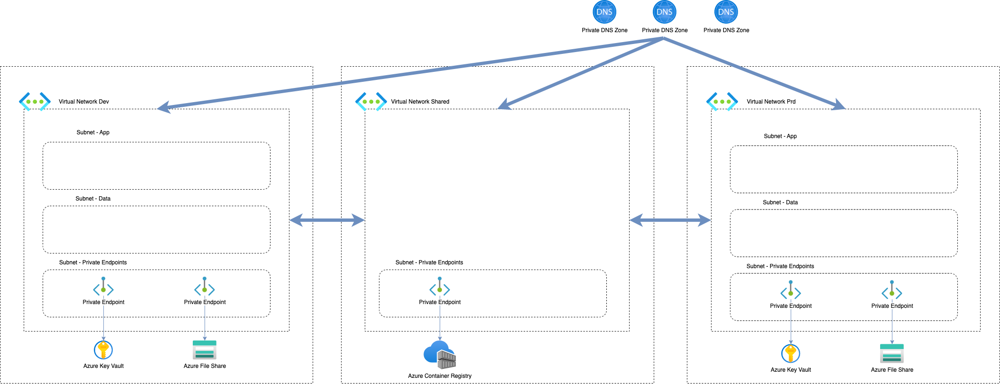

# Zadania Domowe Szkolenie Terraform: Zjazd 5

W ramach tego zestawu zadań rozpoczynamy budowę infrastruktury naszego projektu.
Kod infrastruktury przygotowany w ramach tych zadań będzie wykorzystywany także na kolejnych zjazdach.

Podczas tworzenia zasobów zadbaj o najlepsze praktyki, jakie poznałeś m.in:

* Odpowiednie nazewnictwo zasobów (wykorzystaj numer
  studenta, [skróty zasobów](https://learn.microsoft.com/en-us/azure/cloud-adoption-framework/ready/azure-best-practices/resource-abbreviations)
  itp.)
* Postaraj się pogrupować kod w osobne konfigurację (katalogi), jeśli widzisz, że jest na miejsce,
* Wykorzystaj zmienne w odpowiednich miejscach (kod powinien wdrażać się z wykorzystaniem pliku `.tfvars` dedykowanego
  dla
  danego środowiska)

## Zadanie 1 - Backend

W ramach tego zadania przygotuj początkową konfigurację Terraform:

* Utwórz Storage Account i kontener do przechowywania stanu terraform,
* Wykorzystaj utworzony Storage Account w konfiguracji backendu,
* Przygotuj konfigurację providera Azurerm,
* Pobierz Twoją grupę zasobów przy pomocy `data`.

Na co warto zwrócić uwagę:

* Konfigurację backendu przekaż do Terraform przy pomocy pliku `.tfbackend`
* Storage Account przechowywujący stan powinien być utworzony poza Terraform.

Pomocne linki:

* [Konfiguracja backendu](https://developer.hashicorp.com/terraform/language/settings/backends/configuration)
* [Provider AzureRM](https://registry.terraform.io/providers/hashicorp/azurerm/latest/docs)

## Zadanie 2 - Sieci

Celem tego zadania jest utworzenie sieci pod środowiska aplikacji (dev/prd) i zasoby współdzielone.
Sieci powinny wykorzystywać koncepcję Hub & Spoke, w naszym przypadku Hubem będzie sieć na zasoby współdzielone.

W ramach tego zadania należy utworzyć:

* Sieć wirtualną Shared
* Sieć wirtualną pod środowisko Dev
* Sieć wirtualną pod środowisko Prd
* W ramach sieci Shared utwórz podsieć: endpoints
* W ramach sieci pod aplikacje utwórz podsieci: app, data, endpoints.
* Peering obustronny pomiędzy Shared a środowiskami aplikacji

Na co warto zwrócić uwagę:
* Zakresy sieciowe nie mogą się nachodzić
* Dla każdego subnetu przyjmij maskę sieci co najmniej /24.
* Podczas tworzenia subnetu wartość parametru `enforce_private_link_endpoint_network_policies` ustaw na `true`.

Pomocne linki:

* [Dokumentacja zasobu Virtual Network](https://registry.terraform.io/providers/hashicorp/azurerm/latest/docs/resources/virtual_network)
* [Dokumentacja zasobu Subnet](https://registry.terraform.io/providers/hashicorp/azurerm/latest/docs/resources/subnet)
* [Dokumentacja zasobu Virtual Network Peering](https://registry.terraform.io/providers/hashicorp/azurerm/latest/docs/resources/virtual_network_peering)

## Zadanie 3 - Key Vault

Należy utworzyć Azure Key Vault dedykowany dla środowiska aplikacji.
Podczas tworzenia Key Vault nadaj uprawnienia swojemu użytkownikowi wykorzystując Access Policy.

Na co warto zwrócić uwagę:

* Podczas tworzenia zasobu wybierz sku: Standard
* Wartości object_id oraz tenant_id dla swojego użytkownika może pobrać z portalu lub wykorzystując data
  source `azurerm_client_config`.

Pomocne linki:

* [Dokumentacja zasobu azurerm_key_vault](https://registry.terraform.io/providers/hashicorp/azurerm/latest/docs/resources/key_vault)
* [Dokumentacja data azurerm_client_config]()

## Zadanie 4 - Container Registry

W ramach tego zadania należy utworzyć Azure Container Registry, w którym przechowywane będą obrazy aplikacji.

Na co warto zwrócić uwagę:

* ACR będzie współdzielony pomiędzy środowiskami, dlatego należy go umieścić w sieci Shared,
* Podczas tworzenia zasobu wybierz sku: Premium, tylko w tym planie jest dostępna możliwość komunikacji prywatnej.

Pomocne linki:

* [Dokumentacja zasobu azurerm_container_registry](https://registry.terraform.io/providers/hashicorp/azurerm/latest/docs/resources/container_registry)

## Zadanie 5 - Storage Account

Należy utworzyć Azure Storage Account, po czym dodaj do niego Azure Storage File Share.
Azure Storage File Share zostanie podłączony do aplikacji w celu przechowywania plików.

Na co warto zwrócić uwagę:

* Podczas tworzenia File Share wybierz Quota: 50gb.
* Zasób ten będzie dedykowany dla środowiska aplikacji.

Pomocne linki:

* [Dokumentacja Storage Account](https://registry.terraform.io/providers/hashicorp/azurerm/latest/docs/resources/storage_account)
* [Dokumentacja Storage Share](https://registry.terraform.io/providers/hashicorp/azurerm/latest/docs/resources/storage_share)

## Zadanie 6 - Private Endpoints

W tym zadaniu utworzymy private endpoint dla Azure File Share, Azure Container Registry,
Azure Key Vault. Dzięki temu wszystkie komponenty naszej aplikacji będą wykorzystywały sieć
prywatną przy komunikacji.

Przed przystąpieniem do utworzenia private endpoint, należy utworzyć prywatne
strefy DNS oraz powiązać te strefy DNS z siecią wirtualną.

Prywatne strefy DNS wykorzystywane przez private endpoint powinny korzystać z zalecanych nazw.

Na co warto zwrócić uwagę:

* W bloku `private_service_connection` podczas tworzenia private endpoint, należy wskazać id zasobu, dla którego
  tworzymy endpoint oraz nazwę zasobu podrzędnego.
* W bloku `private_dns_zone_group` podczas tworzenia private endpoint należy wskazać id prywatnej strefy dns, dzięki temu
  odpowiedni rekord A wskazujący na interfejs sieciowy endpointu zostanie automatycznie dodany
* w parametrze `subnet_id` podczas tworzenia private endpoint należy wskazać podsieć przeznaczoną na private endpoint
* Spróbuj wykorzystać `for_each` podczas tworzenia prywatnych stref dns dla aplikacji

Pomocne linki:

* [Zalecane nazwy prywatnych stref dns](https://learn.microsoft.com/pl-pl/azure/private-link/private-endpoint-dns#azure-services-dns-zone-configuration)
* [Dostępne nazwy zasobów podrzędnych](https://learn.microsoft.com/en-gb/azure/private-link/private-endpoint-overview#private-link-resource)
* [Dokumentacja zasobu private_endpoint](https://registry.terraform.io/providers/hashicorp/azurerm/latest/docs/resources/private_endpoint)
* [Dokumentacja zasobu private_dns_zone](https://registry.terraform.io/providers/hashicorp/azurerm/latest/docs/data-sources/private_dns_zone)
* [Dokumentacja zasobu private_dns_zone_virtual_network_link](https://registry.terraform.io/providers/hashicorp/azurerm/latest/docs/resources/private_dns_zone_virtual_network_link)
