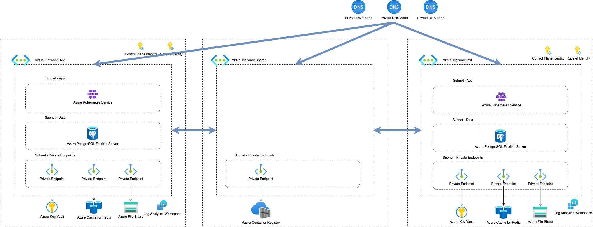

# Zadania Domowe Szkolenie Terraform: Zjazd 6

W ramach tego zestawu zadań rozbudujemy infrastrukturę przygotowaną w poprzednim zadaniu domowym o dodatkowe komponenty.
Podczas testowania zasoby twórz na jednym środowisku, ale przygotowany kod powinien być gotowy do rozstawienia w kilku
środowiskach, na podstawie zmiennych.

# Zadanie 1 - Redis

W ramach tego zadania należy utworzyć instancję Redis.

Komunikacja z Redis powinna odbywać się poprzez sieć prywatną, w tym celu utwórz prywatną strefę DNS i prywatny
endpoint.

Na co warto zwrócić uwagę

* Parametr `capacity` ustaw na `0`.
* Parametr `family` ustaw na `C`.
* Parametr `sku_name` ustaw na `Basic`.
* Podczas tworzenia prywatnej strefy DNS musisz wskazać odpowiednią nazwę dla Redis Cache.
* Podczas tworzenia prywatnego endpointu wskaż odpowiednią nazwę pod-zasobu w konfiguracji `private_service_connection`.
* Prywatny endpoint umieść w odpowiedniej podsieci `endpoints`.

Pomocne linki:

* [Dokumentacja zasobu azurerm_redis_cache](https://registry.terraform.io/providers/hashicorp/azurerm/latest/docs/resources/redis_cache)
* [Nazwy prywatnych stref DNS dla usług w Azure](https://learn.microsoft.com/en-us/azure/private-link/private-endpoint-dns#azure-services-dns-zone-configuration)
* [Nazwy pod-zasobów w Azure](https://learn.microsoft.com/en-us/azure/private-link/private-endpoint-overview#private-link-resource)
* [Dokumentacja zasobu azurerm_private_dns_zone](https://registry.terraform.io/providers/hashicorp/azurerm/latest/docs/resources/private_dns_zone)
* [Dokumentacja zasobu azurerm_private_dns_zone_virtual_network_link](https://registry.terraform.io/providers/hashicorp/azurerm/latest/docs/resources/private_dns_zone_virtual_network_link)
* [Dokumentacja zasobu azurerm_private_endpoint](https://registry.terraform.io/providers/hashicorp/azurerm/latest/docs/resources/private_endpoint)

# Zadanie 2 - PostgreSQL Flexible Server

W ramach tego zadania należy utworzyć bazę danych PostgreSQL.

Komunikacja z bazą danych powinna odbywać się poprzez sieć prywatną, skorzystamy tutaj z integracji PostgreSQL z siecią
wirtualną (VNet Integration).

W aplikacji będziemy wykorzystywać FQDN naszej instancji PostgreSQL, będzie wymagało to utworzenia prywatnej strefy DNS
i przekazania jej podczas konfiguracji zasobu.

Na co warto zwrócić uwagę:

* Hasło do serwera Postgres utwórz przy pomocy zasobu random_password, będzie wymagało to konfiguracji providera random.
* Umieść serwer w odpowiedniej podsieci, będzie wymagało to dodania bloku `delegation` w zasobie podsieci i jego
  skonfigurowania. Przykład konfiguracji znajdziesz w dokumentacji zasobu.
* W parametrze `sku_name` podczas tworzenia serwera podaj: `Standard_B1ms`.

Pomocne linki:

* [Dokumentacja zasobu azurerm_postgresql_flexible_server](https://registry.terraform.io/providers/hashicorp/azurerm/latest/docs/resources/postgresql_flexible_server)
* [Dokumentacja zasobu random_password](https://registry.terraform.io/providers/hashicorp/random/latest/docs/resources/password)
* [Konfiguracja prywatnej strefy DNS dla PostgreSQL Flexible Server](https://learn.microsoft.com/en-us/azure/postgresql/flexible-server/concepts-networking#using-a-private-dns-zone)
* [Dokumentacja zasobu azurerm_private_dns_zone](https://registry.terraform.io/providers/hashicorp/azurerm/latest/docs/resources/private_dns_zone)
* [Dokumentacja zasobu azurerm_private_dns_zone_virtual_network_link](https://registry.terraform.io/providers/hashicorp/azurerm/latest/docs/resources/private_dns_zone_virtual_network_link)

# Zadanie 3 - Monitoring

W ramach tego zadania należy utworzyć Log Analytics Workspace, który będzie wykorzystywany do zbierania logów z klastra
utworzonego w kolejnym zadaniu.

Na co warto zwrócić uwagę:

* Parametr `sku` ustaw na `PerGB2018`,
* Parametr `retention_in_days` ustaw na `30`.

Pomocne linki:

* [Dokumentacja zasobu azurerm_log_analytics_workspace](https://registry.terraform.io/providers/hashicorp/azurerm/latest/docs/resources/log_analytics_workspace)

# Zadanie 4 - AKS

W ramach tego zadania należy utworzyć prywatny Azure Kubernetes Service.

Przed tworzeniem klastra utwórz dwie Managed Identity typu `UserAssigned`, które będą wykorzystywane przez klaster w
blokach `identity`oraz `kubelet_identity`.
Klaster powinien posiadać co najmniej dwie node poole, jedną `system` i jedną `user`.
Tworząc klaster zainstaluj na nim `osm_agent` z wykorzystaniem Log Analytics Workspace, utworzonego w poprzednim
zadaniu. 

Dzięki instalacji OSM agenta będzie możliwość włączenia Container Insights, który wyślę logi do Log Analytics
Workspace utworzonego w poprzednim zadaniu. 

Należy utworzyć również prywatną strefę dns, która będzie wykorzystywana przez klaster - przekaż referencję do niej podczas tworzenia klastra.

Tożsamość Control Plane klastra powinna mieć uprawnienia do:

* Korzystania z Managed Identity `Managed Identity Operator` na poziomie tożsamości Kubelet,
* Możliwość podpięcia File Share do maszyn wirtualnych `Contributor` na poziomie grupy zasobów,
* Edycji wpisów w prywatnej strefie DNS podpiętej do klastra `Private DNS Zone Contributor` na poziomie tej strefy DNS.

Tożsamość Kubelet klastra powinna mieć uprawnienia do:

* Pobierania obrazów z Azure Container Registry `AcrPull`.

Podczas konfiguracji sieciowej klastra w bloku `network_profile` wskaż wartości:

* `network_plugin`: `azure`
* `network_policy`: `azure`
* `outbound_type`: `loadBalancer`
* `load_balancer_sku`: `standard`

Na co warto zwrócić uwagę:

* Podczas konfigurowania `node_pool` wskaż jako rozmiar maszyn wirtualnych `Standard_B2s`, w parametrze `max_count`
  ustaw maksymalnie 2 instancje.
* Wskaż odpowiedni subnet podczas konfiguracji `node_pool`.
* Skonfiguruj odpowiednio blok `osm_agent`, wykorzystują Log Analytics Workspace utworzony w poprzednim zadaniu.
* Skonfiguruj odpowiednio parametr `scope` podczas przypisywania uprawnień dla tożsamości.
* Parametr `private_cluster_enabled` ustaw na `true`.
* Parametr `private_cluster_public_fqdn_enabled` ustaw na `false`.

Pomocne linki:

* [Dokumentacja zasobu azurerm_user_assigned_identity](https://registry.terraform.io/providers/hashicorp/azurerm/latest/docs/resources/user_assigned_identity)
* [Dokumentacja zasobu azurerm_role_assignment](https://registry.terraform.io/providers/hashicorp/azurerm/latest/docs/resources/role_assignment)
* [Dokumentacja zasobu azurerm_private_dns_zone](https://registry.terraform.io/providers/hashicorp/azurerm/latest/docs/resources/private_dns_zone)
* [Dokumentacja zasobu azurerm_private_dns_zone_virtual_network_link](https://registry.terraform.io/providers/hashicorp/azurerm/latest/docs/resources/private_dns_zone_virtual_network_link)
* [Dokumentacja zasobu azurerm_kubernetes_cluster](https://registry.terraform.io/providers/hashicorp/azurerm/latest/docs/resources/kubernetes_cluster)
* [Dokumentacja zasobu azurerm_kubernetes_cluster_node_pool](https://registry.terraform.io/providers/hashicorp/azurerm/latest/docs/resources/kubernetes_cluster_node_pool)
* [Konfiguracja prywatnej strefy dns dla AKS](https://learn.microsoft.com/en-us/azure/aks/private-clusters#configure-private-dns-zone)
* [Wykorzystywanie Managed Identity w AKS](https://learn.microsoft.com/en-us/azure/aks/use-managed-identity)
